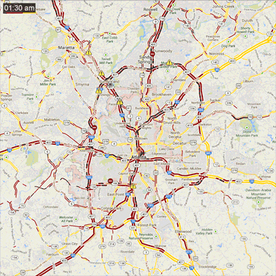

# Traffic Time Lapse Helper

## Description

A script that makes creating time lapses of traffic in Google Maps easy.

## Requirements

The script runs on [**Python 2.7**](http://www.python.org/getit/) and requires [**Selenium for Python**](https://pypi.python.org/pypi/selenium) and [**ImageMagick**](http://www.imagemagick.org/script/index.php). [**PhantomJS**](http://phantomjs.org/download.html) is highly recommended.

## Usage

I used ImageMagick binaries instead of the libraries, and also did not add detection for the binary location, so the path is currently hardcoded into **main.py**. The URL to screenshot and interval between screenshots are also located at the bottom of **main.py**.

Once these variables are set, run the script and it will begin placing formatted 900x900 frames in **/output**. Original frames are kept in **/screenshots**.

## Current Issues

  * Frames are not gathered exactly on an interval, so times gradually shift from :00, :15, to :01, :16, and so on
  * ImageMagick binaries are used instead of libraries
  * ImageMagick path is hardcoded
  * GIF creation is not automated, even though ImageMagick supports it